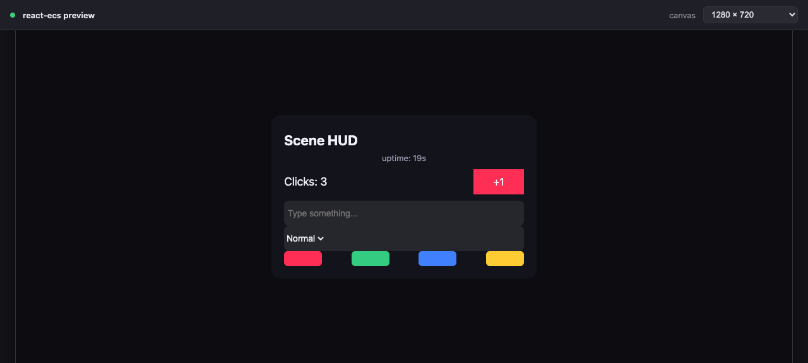

# @dcl/react-ecs-preview

A local, browser-based preview for [`@dcl/react-ecs`](../react-ecs) UIs — with
hot-reload. Edit a UI component, hit save, and see it re-render in the browser in
under a second, without launching the 3D explorer.

> **For content creators:** the productized version of this is the
> [`sdk-commands ui-preview`](../sdk-commands/src/commands/ui-preview) command —
> run `npm run ui-preview` in any scene. It shares this harness but bundles
> against the scene's own `@dcl/sdk`. This package is the monorepo demo/sandbox.



## Why

In a scene, a `react-ecs` UI travels a long road before you see it:

```
<UiEntity/> (JSX)
   → react-reconciler        (turns JSX into ECS entities + components)
   → ECS Engine              (PBUiTransform / PBUiText / PBUiBackground / …)
   → CRDT transport
   → client (Godot/Unity/Bevy) renders it
```

Iterating on layout means rebuilding and reloading the whole thing. But the part
that produces the UI — the reconciler + Engine — has **no rendering-backend
dependency**. We can run it standalone in the browser, read the resulting
component tree, and render it ourselves to DOM. And because `UiTransform` *is*
Yoga (flexbox), the browser's own flex engine does the layout for us.

This package replaces only the last step: instead of the client, a DOM renderer.

## Usage

There are two modes. No install step is required either way: the dev server
reuses the `esbuild` already vendored by `@dcl/sdk-commands`, and resolves
`@dcl/ecs` / `@dcl/react-ecs` from their built `dist/` in this monorepo.

### Demo mode — iterate on a throwaway UI

```bash
cd packages/@dcl/react-ecs-preview
npm start                       # → http://localhost:8123
```

Edit [`src/demo/ui.tsx`](./src/demo/ui.tsx); the page hot-reloads on save.

### Scene mode — preview a real scene's UI

Point the server at a small **debug entry** in your scene that registers the UI
(just like the scene does in-world via `ReactEcsRenderer.setUiRenderer(MyUi)`) and
**default-exports a map of named scenarios** — each puts the UI into a state worth
previewing:

```tsx
// my-scene/preview.debug.tsx — NOT deployed; preview-only
import { setupMyUi, openShop, openInventory } from './ui'
setupMyUi() // calls ReactEcsRenderer.setUiRenderer(...)

export default {
  'Main HUD': () => {},
  Shop: () => openShop(),
  Inventory: () => openInventory()
}
```

```bash
SCENE_ENTRY=/abs/path/to/my-scene/preview.debug.tsx \
  node dev-server.mjs            # from packages/@dcl/react-ecs-preview
```

The preview page shows a **panel switcher** built from the scenario keys. Picking
one reloads with clean UI state and applies that scenario, so you can click
through every panel without editing files.

The bundler aliases `@dcl/sdk/ecs` and `@dcl/sdk/react-ecs` onto this monorepo's
packages, so the scene shares **one engine** with the preview — its
`setUiRenderer`, `engine.addSystem`, and `engine.addEntity` calls all land on the
engine we tick. Host-only modules are replaced with mocks in
[`src/mocks/`](./src/mocks): `@dcl/sdk/players`, `/network`, `/platform`,
`/server`, and `~system/SignedFetch`. If your scene imports a host module that
isn't mocked yet, esbuild errors with its name — add a file to `src/mocks/` and an
alias in `dev-server.mjs`.

**Scene assets** (images/audio referenced by `uiBackground` textures) are served
from the scene directory on `PORT + 1`, and relative texture `src` paths are
rewritten to load from there — so flags, banners, button images, etc. show up.

Editing the debug entry or any scene file it imports hot-reloads the page.
Changing `dev-server.mjs` itself needs a manual restart.

> `PORT=9000` to change port. Picking the **mobile** canvas size makes the mocked
> `isMobile()` return `true` (live), so responsive layouts render in their mobile
> form; `PREVIEW_MOBILE=1` forces it on regardless of canvas.

## How it works

| File | Role |
| --- | --- |
| `dev-server.mjs` | esbuild bundle + watch + live-reload server (port 8123) |
| `src/main.tsx` | Boots the engine, runs a 30 fps frame loop, re-renders the DOM |
| `src/renderer.ts` | Standalone `Engine` + reconciler; reads the UI tree as plain data; synthesizes pointer clicks |
| `src/dom.ts` | Translates the node tree → DOM, mapping `UiTransform` → CSS flexbox |
| `src/enums.ts` | Yoga / text protobuf enums → CSS values |
| `src/demo/ui.tsx` | The sample UI you edit (swap for your own) |
| `src/scene-main.ts` | Scene-mode harness: ticks the global engine and renders it |
| `src/mocks/` | Stubs for host-only modules used in scene mode |

The render path mirrors the production system exactly (see
`react-ecs/src/system.ts`): `setUiRenderer(ui)` → `engine.update(dt)` flushes the
reconciler → we read `UiTransform`/`UiText`/`UiBackground`/`UiInput`/`UiDropdown`
off each entity, rebuild the tree via the `parent` / `rightOf` links, and emit a
`<div>` per entity.

### What works

- **Layout** — full `UiTransform` → CSS flexbox mapping (sizing, margin/padding,
  position, flex, borders, opacity, z-index, overflow).
- **Backgrounds** — solid colors; texture `src` as `background-image`
  (stretch / center modes).
- **Text** — color, font, size, alignment (3×3), wrapping, and the `<b>` / `<i>`
  rich-text tags.
- **Inputs & dropdowns** — rendered as native `<input>` / `<select>`.
- **State & liveness** — `useState` / `useEffect` work; the frame loop reflects
  state changes (e.g. timers) every tick.
- **Clicks** — `onMouseDown` / `onMouseUp` / `onClick` fire through the *real*
  pointer + input systems (we append synthetic `PointerEventsResult` commands),
  so click-driven state updates work.

### Caveats (v1)

- **Layout is the browser's flexbox, not the client's Yoga pass.** Visually ~95%
  identical; not guaranteed pixel-exact. See the upgrade path below.
- **Fonts & textures are approximations.** Browser fonts ≠ in-world fonts;
  texture paths that aren't browser-reachable URLs won't load.
- **`<input>` / `<select>` edits are local** — typing/selecting does not feed
  `UiInputResult` / `UiDropdownResult` back into the scene state.
- **Pointer simulation is click-only** — no hover/drag, no raycast hit data.
- **Scene mode renders against mocked data.** Network/players/storage are stubbed,
  so panels show their empty/disconnected state (e.g. "Unranked", "0 / 72"). The
  canvas-size selector re-seeds `UiCanvasInformation` live, so responsive scale
  recomputes when you resize; the mobile preset (iPhone 14 Pro, landscape
  852×393) also flips `isMobile()` to `true`.
- **Canvas matches the client's content-scale.** Presets are *device* resolutions.
  Like the Godot client (`apply_ui_zoom`), the preview scales each by
  `content_scale = min(w/720, h/720)` and feeds the scene the resulting canvas
  (`UiCanvasInformation` ≈ 720px tall in landscape) + `devicePixelRatio =
  content_scale` — so layout/scale match the real client. A wider device (iPhone
  14 Pro is 2.17:1) shows more side margin than a 16:9 window — that's faithful.
- **Overlapping overlays.** Panels are independent visibility flags; the switcher
  reloads between scenarios so they don't stack. Scenarios that should hide a
  blocking overlay (e.g. a welcome screen) must set its state themselves.

### Upgrade path: pixel-exact layout

For parity with what the client actually computes, swap the browser-flexbox step
for real Yoga: run [`yoga-layout`](https://www.npmjs.com/package/yoga-layout)
(wasm) over the `UiTransform` tree to get absolute rects, then absolutely-position
the divs instead of relying on CSS flex. The component-reading layer
(`renderer.ts`) stays unchanged.
